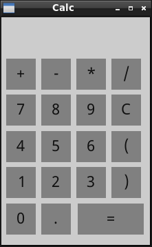
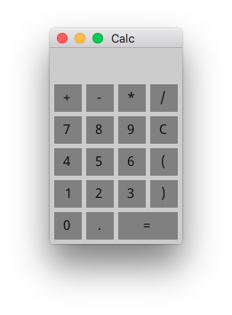
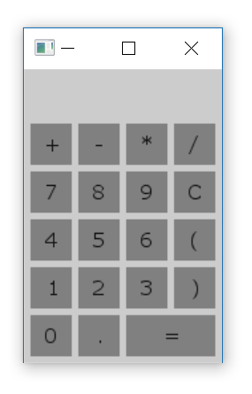

  

# About

This is a repository of examples demonstrating the features of the 
[Fyne](http://fyne.io) UI toolkit and app API written in Go.
The libraries are under heavy development but these examples will continue
to demonstrate the latest capabilities and features.

# Prerequisites

Before you can use the Fyne tools you need to have a stable copy of EFL installed. This will be automated by our [bootstrap](https://github.com/fyne-io/bootstrap/) scripts soon, but for now you need to install at least EFL 1.20 from your package manager or the [Enlightenment downloads](https://download.enlightenment.org/rel/libs/efl/) page.

# Getting Started

Using standard go tools you can install Fyne's core library using:

    go get github.com/fyne-io/fyne-app

And then you're ready to run an example, like this:

    go run calculator/calc.go

It should look like this:

| Linux | Max OS X |
|:-----:|:--------:|
|  |  |  |
