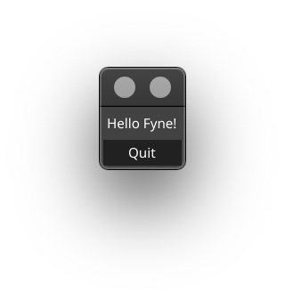
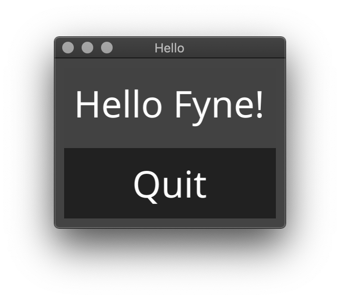
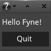
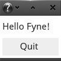

<p align="center">
  <a href="https://godoc.org/github.com/fyne-io/fyne" title="GoDoc Reference" rel="nofollow"></a>
  <a href="https://goreportcard.com/report/github.com/fyne-io/fyne"></a>
  <a href="https://travis-ci.org/fyne-io/fyne"></a>
  <a href='https://coveralls.io/github/fyne-io/fyne?branch=develop'></a>
</p>

# About

[Fyne](http://fyne.io) is an easy to use UI toolkit and app API written in Go. We use the EFL render pipeline to provide cross platform graphics.

This is under heavy development and is not yet capable of supporting a full application

# Getting Started

Fyne is designed to be really easy to code with, here are the steps to your first app.

## Prerequisites

Before you can use the Fyne tools you need to have a stable copy of EFL installed. This will be automated by our [bootstrap](https://github.com/fyne-io/bootstrap/) scripts soon, but for now you can follow our [setup instructions](https://github.com/fyne-io/bootstrap/blob/master/README.md).

Then using standard go tools you can install Fyne's core library using:

    go get github.com/fyne-io/fyne

## Code

And then you're ready to write your first app!

```go
    package main

    import "github.com/fyne-io/fyne/widget"
    import "github.com/fyne-io/fyne/desktop"

    func main() {
    	app := desktop.NewApp()

    	w := app.NewWindow("Hello")
    	w.SetContent(widget.NewList(
    		widget.NewLabel("Hello Fyne!"),
    		widget.NewButton("Quit", func() {
    			app.Quit()
    		}),
    	))

    	w.Show()
    }
```

And you can run that simply as:

    go run main.go

It should look like this:

<p align="center" markdown="1">
  
</p>

# Scaling

Fyne is built entirely using vector graphics which means that applications
that are written using it will scale to any value beautifully (not just whole number values).
The default scale value is equated from your screen's DPI - and if you move
a window to another screen it will re-calculate and adjust the window size accordingly!

<table style="text-align: center"><tr>
<td>
  <br />Standard size</td>
<td>
  <br />FYNE_SCALE=0.5</td>
<td>
  <br />FYNE_SCALE=2.5</td>
</tr></table>

# Themes

Fyne ships with two themes by default, "light" and "dark". You can choose
which to use with the environment variable ```FYNE_THEME```.
The default is dark:

<p align="center" markdown="1">
  
</p>

If you prefer a light theme then you could run:

    FYNE_THEME=light go run main.go

It should then look like this:

<p align="center" markdown="1">
  
</p>

# Widget demo

To run a showcase of the features of fyne execute the following:

    cd $GOPATH/src/github.com/fyne-io/fyne/examples/
    go run main.go

And you should see something like this (after you click a few buttons):

<p align="center" markdown="1" style="max-width: 100%">
  
</p>

Or if you are using the light theme:

<p align="center" markdown="1" style="max-width: 100%">
  
</p>

# Declarative API

If you prefer a more declarative API then that is provided too.
The following is exactly the same as the code above but in this different style.

```go
package main

import "github.com/fyne-io/fyne"
import "github.com/fyne-io/fyne/desktop"
import "github.com/fyne-io/fyne/widget"

func main() {
	app := desktop.NewApp()

	w := app.NewWindow("Hello")
	w.SetContent(&widget.List{Children: []fyne.CanvasObject{
		&widget.Label{Text: "Hello Fyne!"},
		&widget.Button{Text: "Quit", OnTapped: func() {
			app.Quit()
		}},
	}})

	w.Show()
}
```

# Examples

To see the examples you can run examples/main.go and optionally specify an example, like this:

    cd $GOPATH/src/github.com/fyne-io/fyne/examples/
    go run main.go -example calculator

It should look like one of these:

|       | Linux | Max OS X | Windows |
| -----:|:-----:|:--------:|:-------:|
|  dark |  |  |  |
| light |  |  |  |

## Clock

    go run main.go -example clock


## Fractal (Mandelbrot)

    go run main.go -example fractal


