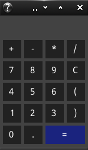
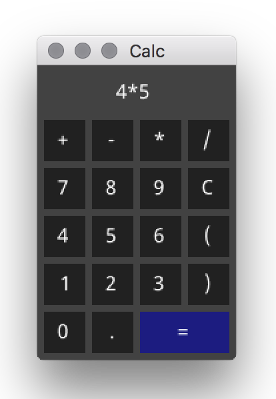
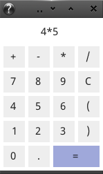
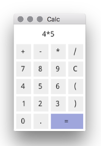
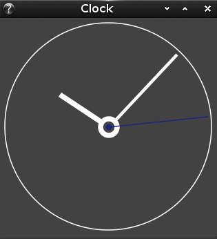
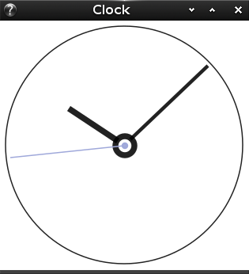

  
  
  
  

# About

[Fyne](http://fyne.io) is an easy to use UI toolkit and app API written in Go. We use the EFL render pipeline to provide cross platform graphics.

This is under heavy development and is not yet capable of supporting a full application

# Prerequisites

Before you can use the Fyne tools you need to have a stable copy of EFL installed. This will be automated by our [bootstrap](https://github.com/fyne-io/bootstrap/) scripts soon, but for now you can follow our [setup instructions](https://github.com/fyne-io/bootstrap/blob/master/README.md).

# Getting Started

Using standard go tools you can install Fyne's core library using:

    go get github.com/fyne-io/fyne

And then you're ready to write your first app - this example shows how:

    package main

    import "github.com/fyne-io/fyne/api/ui/widget"
    import "github.com/fyne-io/fyne/desktop"

    func main() {
    	app := desktop.NewApp()

    	w := app.NewWindow("Hello")
    	quit := widget.NewButton("Quit", func() {
    		app.Quit()
    	})
    	w.Canvas().SetContent(widget.NewList(
    		widget.NewLabel("Hello Fyne!"),
    		quit))

    	w.Show()
    }

And you can run that simply as:

    go run main.go

It should look like this:

  

# Examples

To see the examples you can run examples/main.go and optionally specify an example, like this:

    cd ~/go/src/github.com/fyne-io/fyne/examples/
    go run main.go -example calculator

It should look like one of these:

|       | Linux | Max OS X | Windows |
| -----:|:-----:|:--------:|:-------:|
|  dark |  |  |  |
| light |  |  |  |

## Clock

    go run main.go -example clock

## Fractal (Mandelbrot)

    go run main.go -example fractal

