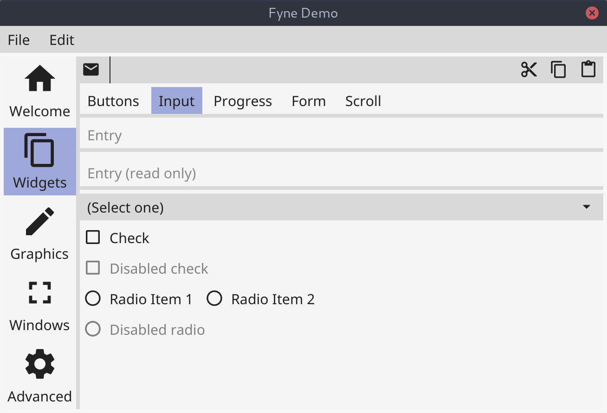
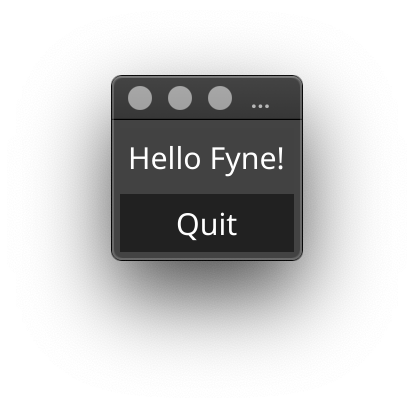

<p align="center">
  <a href="https://pkg.go.dev/fyne.io/fyne?tab=doc" title="Go API Reference" rel="nofollow"></a>
  <a href="https://github.com/fyne-io/fyne/releases/tag/v1.2.3" title="1.2.3 Release" rel="nofollow"></a>
  <a href='http://gophers.slack.com/messages/fyne'></a>
  <br />
  <a href="https://goreportcard.com/report/fyne.io/fyne"></a>
  <a href="https://travis-ci.org/fyne-io/fyne"></a>
  <a href='https://coveralls.io/github/fyne-io/fyne?branch=develop'></a>
  <!--a href='https://sourcegraph.com/github.com/fyne-io/fyne?badge'></a-->
</p>

# About

[Fyne](https://fyne.io) is an easy to use UI toolkit and app API written in Go.
It is designed to build applications that run on desktop and mobile devices with a
single codebase.

Version 1.2 is the current release which added support for iOS and Android devices
as well as providing much simpler ways to write custom widgets.
We are now working towards 1.3 which will add data binding and some more advanced
widgets such as tables and lists.

# Prerequisites

To develop apps using Fyne you will need Go version 1.12 or later, a C compiler and your system's development tools.
If you're not sure if that's all installed or you don't know how then check out our
[Getting Started](https://fyne.io/develop/) document.

Using the standard go tools you can install Fyne's core library using:

    $ go get fyne.io/fyne

# Widget demo

To run a showcase of the features of Fyne execute the following:

    $ go get fyne.io/fyne/cmd/fyne_demo/
    $ fyne_demo

And you should see something like this (after you click a few buttons):

<p align="center" markdown="1" style="max-width: 100%">
  
</p>

Or if you are using the light theme:

<p align="center" markdown="1" style="max-width: 100%">
  
</p>

# Getting Started

Fyne is designed to be really easy to code with.
If you have followed the prerequisite steps above then all you need is a
Go IDE (or a text editor). 

Open a new file and you're ready to write your first app!

```go
package main

import (
	"fyne.io/fyne/widget"
	"fyne.io/fyne/app"
)

func main() {
	app := app.New()

	w := app.NewWindow("Hello")
	w.SetContent(widget.NewVBox(
		widget.NewLabel("Hello Fyne!"),
		widget.NewButton("Quit", func() {
			app.Quit()
		}),
	))

	w.ShowAndRun()
}
```

And you can run that simply as:

    go run main.go

It should look like this:

<p align="center" markdown="1">
  
</p>

> Note that Windows applications load from a command prompt by default, which means if you click an icon you may see a command window.
> To fix this add the parameters `-ldflags -H=windowsgui` to your run or build commands.

# Documentation

More documentation is available at the [Fyne developer website](https://fyne.io/develop/) or on [pkg.go.dev](https://pkg.go.dev/fyne.io/fyne?tab=doc).

# Examples

You can find many example applications in the [examples repository](https://github.com/fyne-io/examples/).
Alternatively a list of applications using fyne can be found at [our website](https://apps.fyne.io/).
