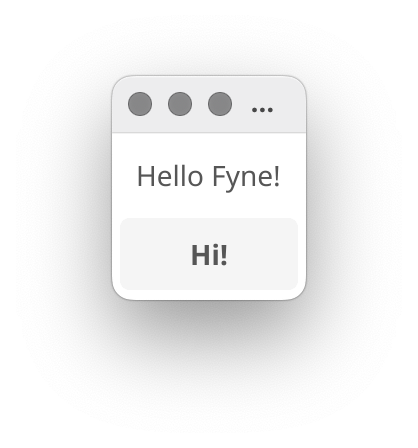
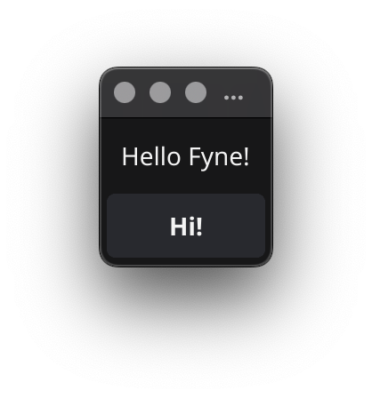

<p align="center">
  <a href="https://pkg.go.dev/fyne.io/fyne?tab=doc" title="Go API Reference" rel="nofollow"></a>
  <a href="https://github.com/fyne-io/fyne/releases/tag/v1.4.2" title="1.4.2 Release" rel="nofollow"></a>
  <a href='http://gophers.slack.com/messages/fyne'></a>
  <br />
  <a href="https://goreportcard.com/report/fyne.io/fyne"></a>
  <a href="https://github.com/fyne-io/fyne/actions"></a>
  <a href='https://coveralls.io/github/fyne-io/fyne?branch=develop'></a>
</p>

# About

[Fyne](https://fyne.io) is an easy to use UI toolkit and app API written in Go.
It is designed to build applications that run on desktop and mobile devices with a
single codebase.

Version 1.4 is the current release - it introduced high performance collection widgets,
Card, Separator and FileIcon widgets as well as a folder open dialog.
It also saw a theme refresh updating the colors and button styles for a more
material design look.
We are now working towards [2.0](https://github.com/fyne-io/fyne/milestone/6)
which aims to add data bindings, animations and more!

# Prerequisites

To develop apps using Fyne you will need Go version 1.12 or later, a C compiler and your system's development tools.
If you're not sure if that's all installed or you don't know how then check out our
[Getting Started](https://fyne.io/develop/) document.

Using the standard go tools you can install Fyne's core library using:

    $ go get fyne.io/fyne

# Widget demo

To run a showcase of the features of Fyne execute the following:

    $ go get fyne.io/fyne/cmd/fyne_demo/
    $ fyne_demo

And you should see something like this (after you click a few buttons):

<p align="center" markdown="1" style="max-width: 100%">
  
</p>

Or if you are using the light theme:

<p align="center" markdown="1" style="max-width: 100%">
  
</p>

# Getting Started

Fyne is designed to be really easy to code with.
If you have followed the prerequisite steps above then all you need is a
Go IDE (or a text editor). 

Open a new file and you're ready to write your first app!

```go
package main

import (
	"fyne.io/fyne/app"
	"fyne.io/fyne/widget"
)

func main() {
	a := app.New()
	w := a.NewWindow("Hello")

	hello := widget.NewLabel("Hello Fyne!")
	w.SetContent(widget.NewVBox(
		hello,
		widget.NewButton("Hi!", func() {
			hello.SetText("Welcome :)")
		}),
	))

	w.ShowAndRun()
}
```

And you can run that simply as:

    go run main.go

It should look like this:

<div align="center">
  <table cellpadding="0" cellspacing="0" style="margin: auto; border-collapse: collapse;">
    <tr style="border: none;"><td style="border: none;">
      
    </td><td style="border: none;">
      
    </td></tr>
  </table>
</div>

> Note that Windows applications load from a command prompt by default, which means if you click an icon you may see a command window.
> To fix this add the parameters `-ldflags -H=windowsgui` to your run or build commands.

# Installing

Using `go install` will copy the executable into your go `bin` dir.
To install the application with icons etc into your operating system's standard
application location you can use the fyne utility and the "install" subcommand.

    $ go get fyne.io/fyne/cmd/fyne
    $ fyne install

# Packaging a release

Using the fyne utility "release" subcommand you can package up your app for release
to app stores and market places. Make sure you have the standard build tools installed
and have followed the platform documentation for setting up accounts and signing.
Then you can execute something like the following, notice the `-os ios` parameter allows
building an iOS app from macOS computer. Other combinations work as well :)

    $ fyne release -os ios -certificate "Apple Distribution" -profile "My App Distribution" -appID "com.example.myapp"
    
The above command will create a '.ipa' file that can then be uploaded to the iOS App Store.

# Documentation

More documentation is available at the [Fyne developer website](https://developer.fyne.io/) or on [pkg.go.dev](https://pkg.go.dev/fyne.io/fyne?tab=doc).

# Examples

You can find many example applications in the [examples repository](https://github.com/fyne-io/examples/).
Alternatively a list of applications using fyne can be found at [our website](https://apps.fyne.io/).
