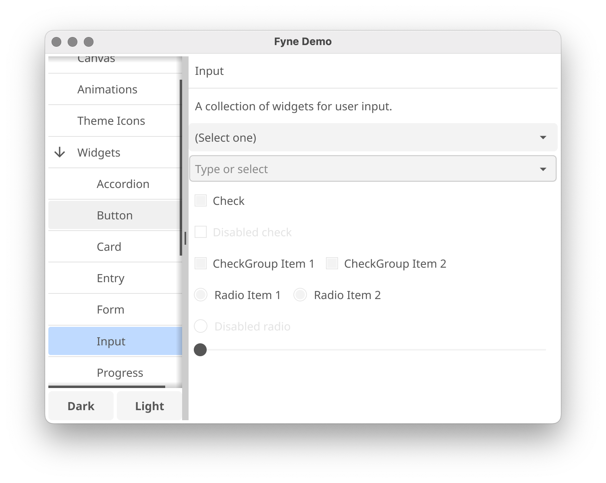

<p align="center">
  <a href="https://pkg.go.dev/fyne.io/fyne/v2?tab=doc" title="Go API Reference" rel="nofollow"></a>
  <a href="https://img.shields.io/github/v/release/fyne-io/fyne?include_prereleases" title="Latest Release" rel="nofollow"></a>
  <a href='http://gophers.slack.com/messages/fyne'></a>
  <br />
  <a href="https://goreportcard.com/report/fyne.io/fyne/v2"></a>
  <a href="https://github.com/fyne-io/fyne/actions"></a>
  <a href='https://coveralls.io/github/fyne-io/fyne?branch=develop'></a>
</p>

# About

[Fyne](https://fyne.io) is an easy-to-use UI toolkit and app API written in Go.
It is designed to build applications that run on desktop and mobile devices with a
single codebase.

Version 2.1 is the current release of the Fyne API, it introduced RichText
and the DocTabs container, as well as the document storage API and FyneApp.toml
metadata support.
We are now working towards the next big release, codenamed
[bowmore](https://github.com/fyne-io/fyne/milestone/15)
and more news will follow in our news feeds and GitHub project.

# Prerequisites

To develop apps using Fyne you will need Go version 1.14 or later, a C compiler and your system's development tools.
If you're not sure if that's all installed or you don't know how then check out our
[Getting Started](https://fyne.io/develop/) document.

Using the standard go tools you can install Fyne's core library using:

    $ go get fyne.io/fyne/v2

# Widget demo

To run a showcase of the features of Fyne execute the following:

    $ go get fyne.io/fyne/v2/cmd/fyne_demo/
    $ fyne_demo

And you should see something like this (after you click a few buttons):

<p align="center" markdown="1" style="max-width: 100%">
  
</p>

Or if you are using the light theme:

<p align="center" markdown="1" style="max-width: 100%">
  
</p>

And even running on a mobile device:

<p align="center" markdown="1" style="max-width: 100%">
  
</p>

# Getting Started

Fyne is designed to be really easy to code with.
If you have followed the prerequisite steps above then all you need is a
Go IDE (or a text editor).

Open a new file and you're ready to write your first app!

```go
package main

import (
	"fyne.io/fyne/v2/app"
	"fyne.io/fyne/v2/container"
	"fyne.io/fyne/v2/widget"
)

func main() {
	a := app.New()
	w := a.NewWindow("Hello")

	hello := widget.NewLabel("Hello Fyne!")
	w.SetContent(container.NewVBox(
		hello,
		widget.NewButton("Hi!", func() {
			hello.SetText("Welcome :)")
		}),
	))

	w.ShowAndRun()
}
```

And you can run that simply as:

    $ go run main.go

It should look like this:

<div align="center">
  <table cellpadding="0" cellspacing="0" style="margin: auto; border-collapse: collapse;">
    <tr style="border: none;"><td style="border: none;">
      
    </td><td style="border: none;">
      
    </td></tr>
  </table>
</div>

> Note that Windows applications load from a command prompt by default, which means if you click an icon you may see a command window.
> To fix this add the parameters `-ldflags -H=windowsgui` to your run or build commands.

## Run in mobile simulation

There is a helpful mobile simulation mode that gives a hint of how your app would work on a mobile device:

    $ go run -tags mobile main.go

Another option is to use `fyne` command, see [Packaging for mobile](#packaging-for-mobile).

# Installing

Using `go install` will copy the executable into your go `bin` dir.
To install the application with icons etc into your operating system's standard
application location you can use the fyne utility and the "install" subcommand.

    $ go get fyne.io/fyne/v2/cmd/fyne
    $ fyne install

# Packaging for mobile

To run on a mobile device it is necessary to package up the application.
To do this we can use the fyne utility "package" subcommand.
You will need to add appropriate parameters as prompted, but the basic command is shown below.
Once packaged you can install using the platform development tools or the fyne "install" subcommand.

    $ fyne package -os android -appID my.domain.appname
    $ fyne install -os android

The built Android application can run either in a real device or an Android emulator.
However, building for iOS is slightly different.
If the "-os" argument is "ios", it is build only for a real iOS device.
Specify "-os" to "iossimulator" allows the application be able to run in an iOS simulator:

    $ fyne package -os ios -appID my.domain.appname
    $ fyne package -os iossimulator -appID my.domain.appname

# Preparing a release

Using the fyne utility "release" subcommand you can package up your app for release
to app stores and market places. Make sure you have the standard build tools installed
and have followed the platform documentation for setting up accounts and signing.
Then you can execute something like the following, notice the `-os ios` parameter allows
building an iOS app from macOS computer. Other combinations work as well :)

    $ fyne release -os ios -certificate "Apple Distribution" -profile "My App Distribution" -appID "com.example.myapp"

The above command will create a '.ipa' file that can then be uploaded to the iOS App Store.

# Documentation

More documentation is available at the [Fyne developer website](https://developer.fyne.io/) or on [pkg.go.dev](https://pkg.go.dev/fyne.io/fyne/v2?tab=doc).

# Examples

You can find many example applications in the [examples repository](https://github.com/fyne-io/examples/).
Alternatively a list of applications using fyne can be found at [our website](https://apps.fyne.io/).

# Shipping the Fyne Toolkit

All Fyne apps will work without pre-installed libraries, this is one reason the apps are so portable.
However, if looking to support Fyne in a bigger way on your operating system then you can install some utilities that help to make a more complete experience.

## Additional apps

It is recommended that you install the following additional apps:

| app | go get | description |
| --- | ------ | ----------- |
| fyne_settings | `fyne.io/fyne/v2/cmd/fyne_settings` | A GUI for managing your global Fyne settings like theme and scaling |
| apps | `github.com/fyne-io/apps` | A graphical installer for the Fyne apps listed at https://apps.fyne.io |

These are optional applications but can help to create a more complete desktop experience.

## FyneDesk (Linux / BSD)

To go all the way with Fyne on your desktop / laptop computer you could install [FyneDesk](https://github.com/fyne-io/fynedesk) as well :)
