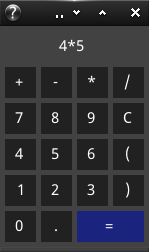
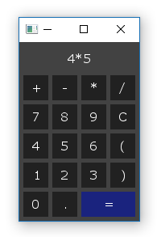
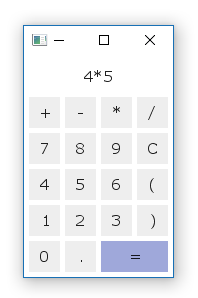
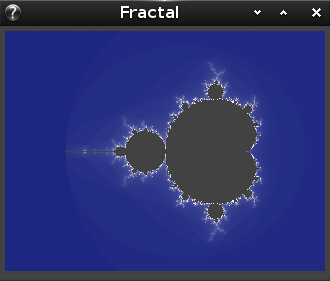

# About

This is a repository of examples demonstrating the features of the
[Fyne](http://fyne.io) UI toolkit and app API written in Go.
The libraries are under heavy development but these examples will continue
to demonstrate the latest capabilities and features.

# Prerequisites

Before you can use the Fyne tools you need to have a stable copy of EFL installed. This will be automated by our [bootstrap](https://github.com/fyne-io/bootstrap/) scripts soon, but for now you can follow our [setup instructions](https://github.com/fyne-io/bootstrap/blob/master/README.md).

# Getting Started

Using standard go tools you can install Fyne's core library using:

    go get github.com/fyne-io/fyne

And then you're ready to run an example, like this:

    cd ~/go/src/github.com/fyne-io/fyne/examples/
    go run main.go -example calculator

It should look like one of these:

|       | Linux | Max OS X | Windows |
| -----:|:-----:|:--------:|:-------:|
|  dark |  |  |  |
| light |  |  |  |

# Examples

## Clock

    go run main.go -example clock

## Fractal (Mandelbrot)

    go run main.go -example fractal

